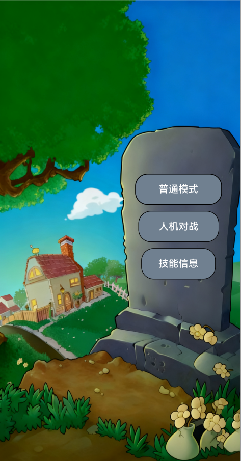
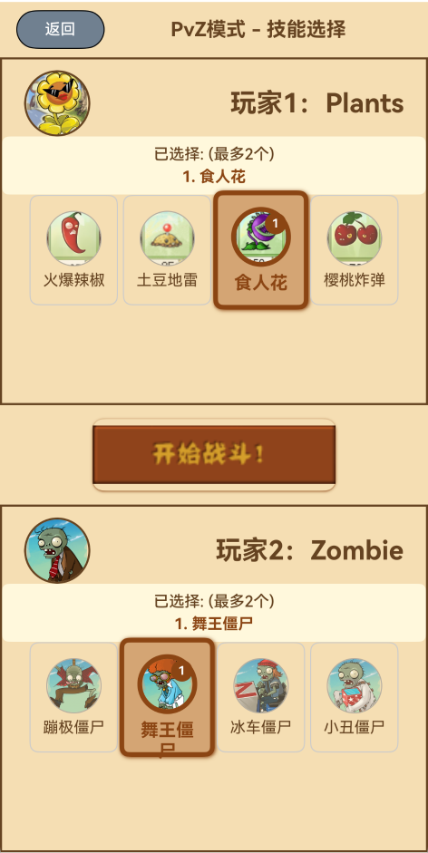
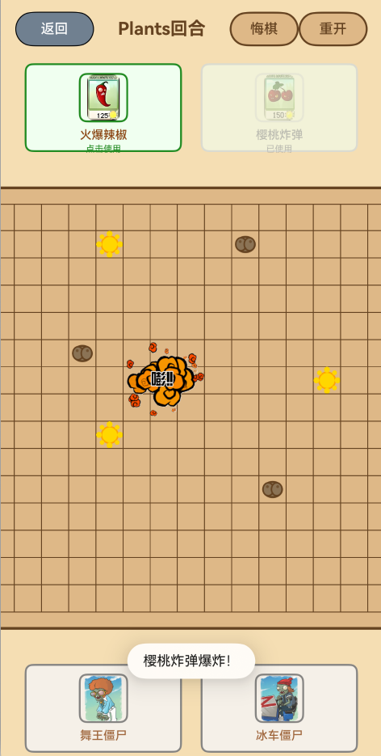
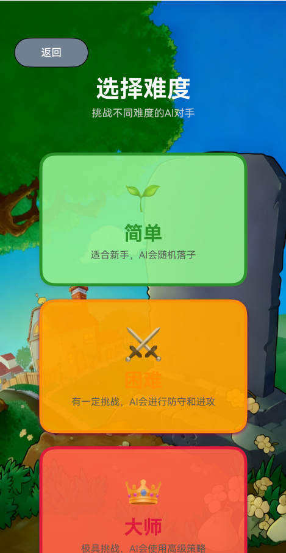
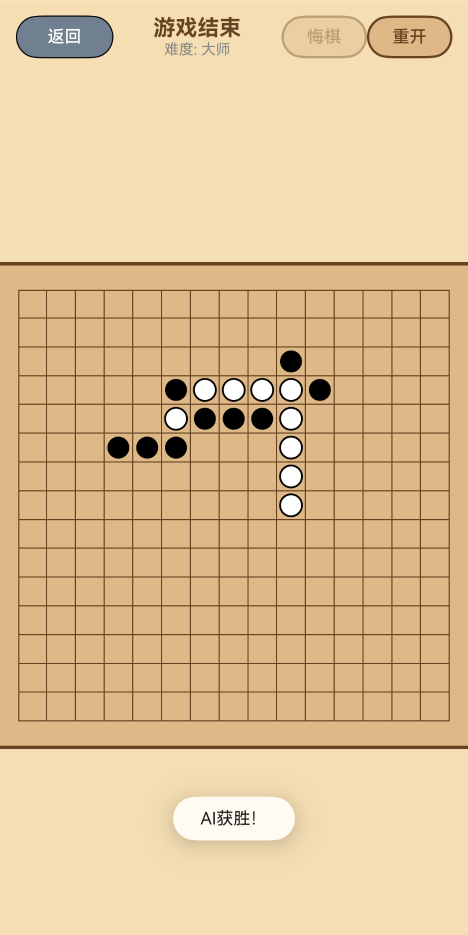
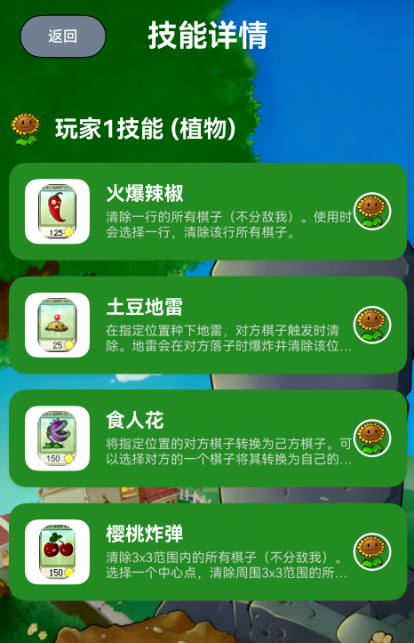
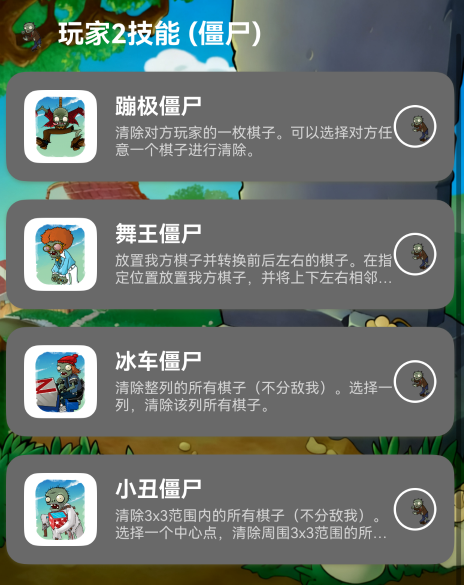
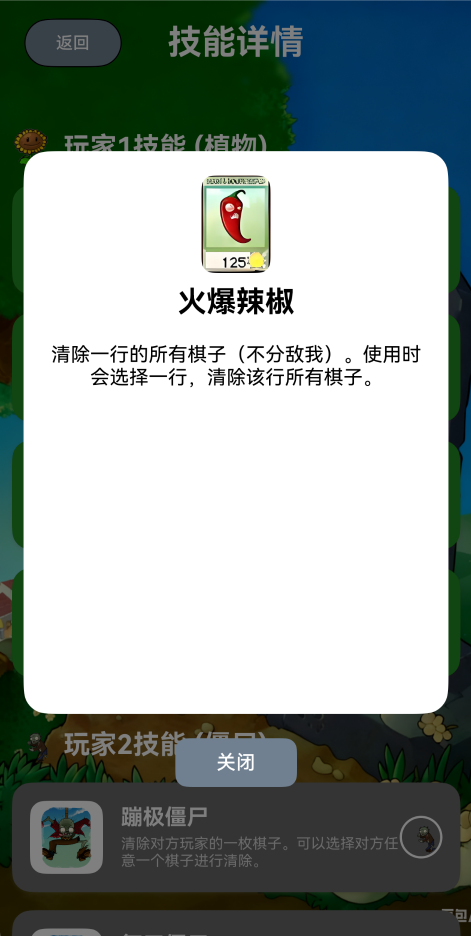
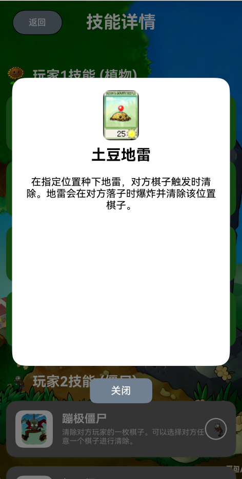

# PvZgobang
一个基于DevEco的HarmonyOS程序，使用arkTs架构的五子棋游戏，同时加入了植物大战僵尸的元素和技能，增加了更多的可玩性

我用夸克网盘给你分享了「PvZgobang」，点击链接或复制整段内容，打开「夸克APP」即可获取。
/~5a683M4Wxq~:/
链接：https://pan.quark.cn/s/ed79c91c9c8e?pwd=anV4
提取码：anV4

## 应用详情页面展示：

